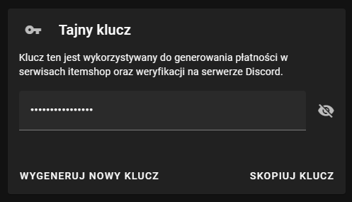
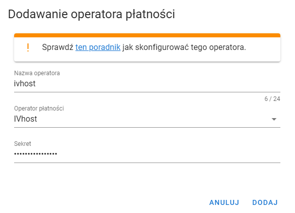

!!!info Informacja
IVhost nie jest operatorem płatności, a hostingiem serwerów posiadającym integrację z itemshopem.
!!!

## Klucz z IVhost
Pierwszym krokiem jest przejście do panelu [IVhost](https://ivhost.pl) i zalogowanie się lub zarejestrowanie (trzeba
potwierdzić adres e-mail). Po zalogowaniu się przechodzimy do zakładki konto w panelu IVhost i w polu "Tajny klucz" klikamy
wygeneruj nowy klucz, a następnie klikamy skopiuj klucz.

## Dodanie IVhost do VIshop
Przechodzimy teraz do panelu VIshop, wybieramy interesujący nas sklep, a następnie przechodzimy do zakładki operatorzy
płatności. Klikamy teraz "Dodaj operatora płatności", następnie wybieramy operatora IVhost i nazywamy go 
(np. IVhost), a w polu sekret wklejamy nasz tajny klucz z panelu IVhost.

## Ustawienie ceny operatora
Teraz musimy edytować każdy produkt i ustawić w nim cenę dla operatora IVhost. Jeżeli nie mamy produktów to po prostu
przy dodawaniu nowych produktów ustawiamy cenę dla operatora IVhost.